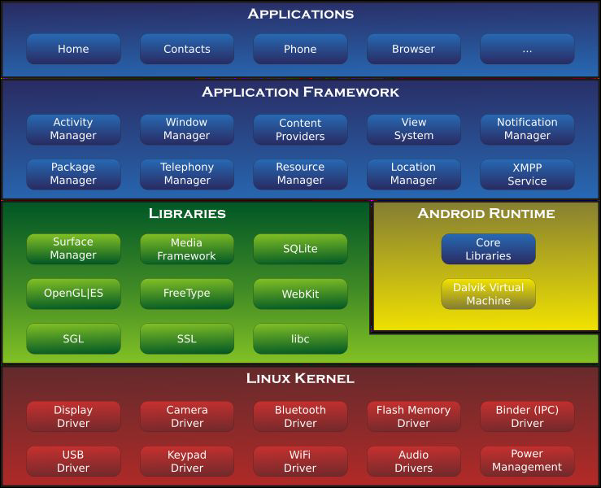
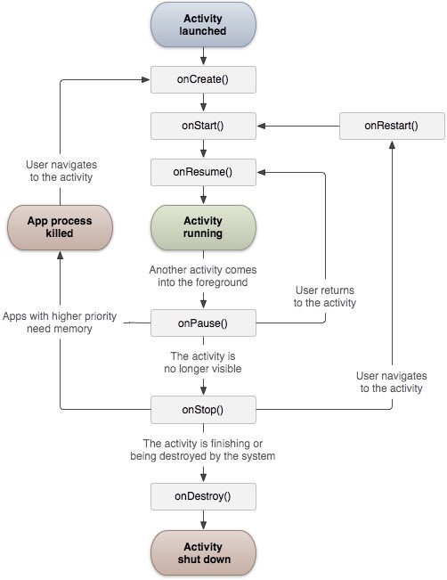

## 1. Android常见概念

**SDK** ： Software-Development-Kit, 软件开发工具包

**NDK** ： Native-Development-Kit，Android原生开发工具包，允许使用C/C++语言来实现应用程序的部分功能

**JNI** ：JNI 是指Java原生接口，是Java调用 C/C++的规范，同时JNI也是JVM规范的一部分

> 【Google官方解释】：
>
> JNI 是指 Java 原生接口。它定义了 Android 从受管理代码（使用 Java 或 Kotlin 编程语言编写）编译的字节码与原生代码（使用 C/C++ 编写）互动的方式。JNI 不依赖于供应商，支持从动态共享库加载代码，虽然有时较为繁琐，但效率尚可。

🍳[Android-NDK与JNI基础概述](https://www.jianshu.com/p/87ce6f565d37)

## 2. Android系统架构

### Applications

**Applications-应用程序层**

**负责与用户直接交互**。我们常用的APP都位于这一层，系统内置的应用程序以及非系统级的应用程序都属于应用层

### Application FrameWork

**Application FrameWork-应用框架层**

提供开发Android应用程序所需的一系列类库，高度封装直接调用。安卓开发主要是在第二层和第三层，通过各种的框架来实现我们的Application。

### Libraries-Android Runtime

Android的系统运行库层。

**Libraries-系统库层**

Libraries包含了9个子库，系统库为组件提供服务。

如：SQLite 库提供了数据库的支持，OpenGL|ES 库提供了3D 绘图的支持，Webkit 库提供了浏览器内核的支持等。

 

**Android Runtime-安卓运行时**

- Core Libraries : 核心库
- Dalvik Virtual Machine : 虚拟机

Android Runtime里的Core Libraries就相当于Java的JDK，是运行android应用程序所需要的核心库；Dalvik Virtual Machine类比于JVM，是Google专为Android开发的-运行android应用程序所需的虚拟机，对其生命周期进行管理。相较于Java 虚拟机，Dalvik 是专门为移动设备定制的，它针对手机内存、
CPU 性能有限等情况做了优化处理。

### Linux Kernel

**Linux Kernel-Linux内核**

Linux Kernel：Android其实就是一个操作系统，其底层是基于Linux Kernel 2.6 的，这一层主要完成的是操作系统所具有的功能，层为Android 设备的各种硬件提供了底层的驱动，如显示驱动、音频驱动、照相机驱动、蓝牙驱动、WiFi 驱动、电源管理等。

 

## 3. 虚拟机DVM

**1. 实现的差别**

- Dalvik：基于寄存器，编译和运行更快
- JVM：基于栈，编译和运行稍慢

**2. 字节码的区别**

- Dalvik：执行`.dex`格式的字节码，是对`.class`文件进行压缩后产生的，文件变小
- JVM：class文件

**3. 运行环境的却别**

- Dalvik：一个**应用启动都运行一个单独的虚拟机**，运行在一个**单独的进程**中
- JVM：只能运行一个实例，所用应用都运行在同一个JVM中

 

## 4. Android版本

甜点为代号的各个安卓版本：

- 1.5 Cupcake（纸杯蛋糕）
- 1.6 Donut（甜甜圈）
- 2.2 Froyo（冻酸奶）
- 2.3 Gingerbread（姜饼）
- 3.x Honeycomb（蜂巢）
- 4.0 Ice Cream Sandwich（冰激凌三明治）
- 4.1 Jelly Bean（果冻豆）
- 4.4 KitKat（奇巧巧克力）
- 5.0 Lollipop（棒棒糖）
- 6.0 Marshmallow（棉花糖）
- 7.0 Nougat（牛轧糖）
- 8.0 Oreo（奥利奥）
- 9.0 Pie (派)
- 10.0 Android 10

> Google从Android 10开始，版本号将不再以甜点命名;目前Android 10 的命名就位Android 10

 

## 5. Android应用开发特色

### 四大组件

**🎨Activity（活动）**

所有Android应用程序的门面，为用户所展示的页面。所有的应用程序的流程都是运行在Activity中，是开发者遇到最繁琐、最基本的模块。一个Android应用是由多个Activity组成，多个Activity之间的应用可以进行相互的跳转。

Java程序从`main()`函数开始。很类似的，Android 系统初始化它的程序是通过**Activity**中的 `onCreate()`回调的调用开始的。存在有一序列的回调方法来启动一个活动，同时有一序列的方法来关闭活动，如下面的活动声明周期图所示：

| 回调        | 描述                                                         |
| :---------- | :----------------------------------------------------------- |
| onCreate()  | 这是第一个回调，在活动第一次创建时调用                       |
| onStart()   | 这个回调在活动为用户可见时被调用                             |
| onResume()  | 这个回调在应用程序与用户开始可交互的时候调用                 |
| onPause()   | 被暂停的活动无法接受用户输入，不能执行任何代码。当前活动将要被暂停，上一个活动将要被恢复时调用 |
| onStop()    | 当活动不在可见时调用                                         |
| onDestroy() | 当活动被系统销毁之前调用                                     |
| onRestart() | 当活动被停止以后重新打开时调用                               |

 

---------------------------

**📦Service（服务）**

服务是一个后台运行的组件，**执行长时间运行且不需要用户交互的任务**。即使应用被销毁也依然可以工作。

> 如我一遍在后台放着网抑云听歌，一边在刷着B乎。虽然我在和B乎的Activity交互，但是歌曲并没有停止；其实就是由播放音乐的Service在控制着。

服务基本上包含**两种状态**：

| 状态    | 描述                                                         |
| :------ | :----------------------------------------------------------- |
| Started | Android的应用程序组件。如活动，通过startService()启动了服务，则服务是Started状态。一旦启动，服务可以在后台无限期运行，即使启动它的组件已经被销毁。 |
| Bound   | 当Android的应用程序组件通过bindService()绑定了服务，则服务是Bound状态。Bound状态的服务提供了一个客户服务器接口来允许组件与服务进行交互，如发送请求，获取结果，甚至通过IPC来进行跨进程通信。 |

 

-----------

**🔊Broadcast Receiver（广播接收器）**

是应用程序之间传输消息的机制。广播接收器可以允许你的应用接收来自各处的广播消息，比如电话、短信等，应用同样也可以向外发出广播消息。

-----------------

**📫Content Provider（内容提供者）**

内容提供者组件：通过请求-从一个应用程序向其他的应用程序提供数据。

Android虽然是开源的，但是对数据的保护是很严密的。除了放在SD卡上的数据和该应用所持有的数据库、文件等内容，其他是**不允许其他应用直接访问的**。Android当然不会将每个应用做成孤岛，它为所有应用准备了一扇窗，就是Content-Privider

-------------------

 

### 丰富的控件系统

Android 系统为开发者提供了丰富的系统控件，使得我们可以很轻松地编写出漂亮的界面。我的理解是类似于很多前端的组件，如BootStrap、Element UI、Ant Design、Vant UI、Laiui等等这些封装好的组件提供我们使用，加快开发效率。

### SQLite数据库

Android 系统还自带了这种轻量级、运算速度极快的嵌入式关系型数据库。它不仅支持标准的SQL语法，还可以通过Android封装好的API进行操作，让存储和读取数据变得非常方便。

### 地理定位系统

**Location Based Services定位服务**。用百度地图 Android SDKS开发适用于Android系统移动设备的地图应用，通过调用地图SDK接口，可以轻松访问百度地图服务和数据，构建功能丰富、交互性强的地图类应用程序。

### 强大的多媒体
Android 系统还提供了丰富的多媒体服务，如音乐、视频、录音、拍照、闹铃等等，这一切都可以在程序中通过代码进行控制，让应用变得更加丰富多彩。

### 传感器
Android 手机中都会内置多种传感器，如加速度传感器、方向传感器等，这也算是移动设备的一大特点。通过灵活地使用这些传感器，可以做出很多在PC上根本无法实现的应用。

--------------------------

【参考内容】

[1] 菜鸟教程.[Android 教程](https://www.runoob.com/android/android-acitivities.html)

[2] 郭霖.《第一行代码》https://zhuanlan.zhihu.com/p/122968154

