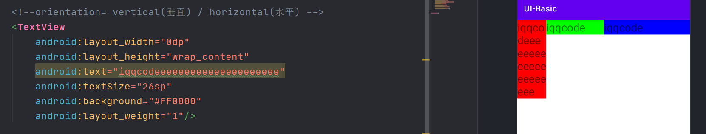
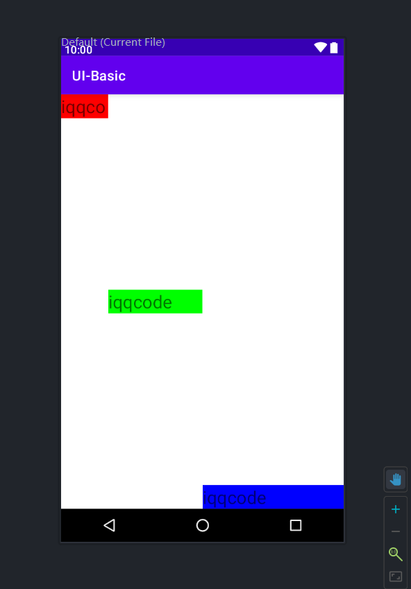
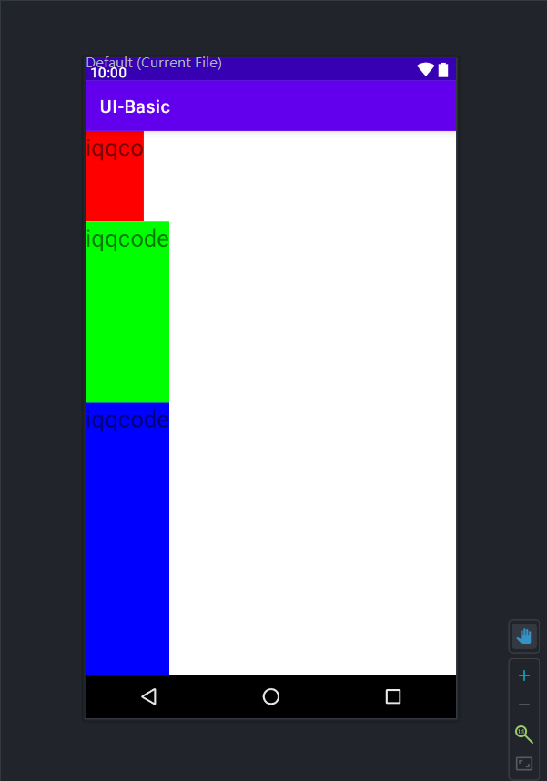
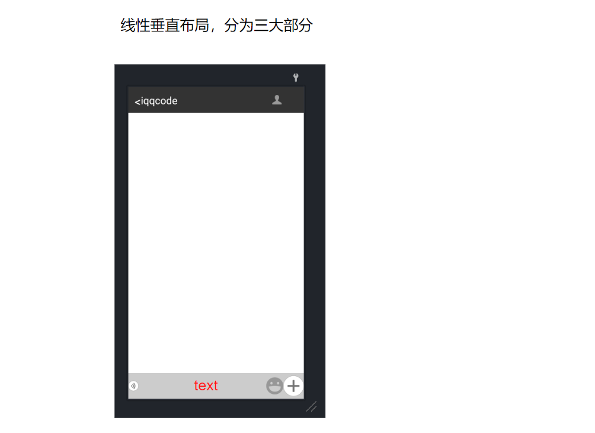

## 线性布局重要属性

- `android:orientation` 方向
- `android:layout_weight` 权重
- `android:layout_gravity` 重力

**【orientation方向】**

- vertical(垂直)
- horizontal(水平)

**【layout_weight权重】**

- 给其内部控件使用，添加了属性值会最后摆放
- 在按比例划分时，需将`layout_width`调整为0dp
- 文本过长时，文本可能被“挤出去”，但是比例不变



**【layout_gravity重力】**

重力：表现为往那边靠拢。与orientation方向的选择有关

- top : 靠上
- center 、center_vertical、center_horizontal : 水平居中
- bottom : 底部

- [x] 如果是`vertical`，则上下空间固定，可以左右偏移

- [x] 如果是`horizontal`，则横向空间固定，可以上下偏移



水平布局

```xml
<?xml version="1.0" encoding="utf-8"?>
<LinearLayout xmlns:android="http://schemas.android.com/apk/res/android"
    android:orientation="horizontal"
    android:layout_width="match_parent"
    android:layout_height="match_parent">

    <!--orientation= vertical(垂直) / horizontal(水平) -->
    <TextView
        android:layout_width="0dp"
        android:layout_height="wrap_content"
        android:text="iqqco"
        android:textSize="26sp"
        android:background="#FF0000"
        android:layout_weight="1"/>

    <TextView
        android:layout_width="0dp"
        android:layout_height="wrap_content"
        android:text="iqqcode"
        android:textSize="26sp"
        android:background="#00FF00"
        android:layout_weight="2"
        android:layout_gravity="center"/>

    <TextView
        android:layout_width="0dp"
        android:layout_height="wrap_content"
        android:text="iqqcode"
        android:textSize="26sp"
        android:background="#0000FF"
        android:layout_weight="3"
        android:layout_gravity="bottom"/>
</LinearLayout>
```





## 聊天Demo窗口



```xml
<?xml version="1.0" encoding="utf-8"?>
<LinearLayout xmlns:android="http://schemas.android.com/apk/res/android"
    android:layout_width="match_parent"
    android:layout_height="match_parent"
    android:orientation="vertical">

    <LinearLayout
        android:layout_width="match_parent"
        android:layout_height="60dp"
        android:background="#333333"
        android:orientation="horizontal"
        android:padding="15dp">

        <TextView
            android:layout_width="wrap_content"
            android:layout_height="wrap_content"
            android:layout_gravity="center_vertical"
            android:text="<"
            android:textColor="#FFFFFF"
            android:textSize="28sp" />

        <TextView
            android:layout_width="0dp"
            android:layout_height="wrap_content"
            android:layout_gravity="center_vertical"
            android:layout_weight="1"
            android:text="iqqcode"
            android:textColor="#FFFFFF"
            android:textSize="24sp" />

        <ImageView
            android:layout_width="wrap_content"
            android:layout_height="wrap_content"
            android:src="@mipmap/menu_logout_icon" />
    </LinearLayout>

    <LinearLayout
        android:layout_width="match_parent"
        android:layout_height="match_parent"
        android:layout_weight="1"
        android:orientation="horizontal">

    </LinearLayout>

    <LinearLayout
        android:layout_width="match_parent"
        android:layout_height="60dp"
        android:background="#cccccc"
        android:orientation="horizontal">

        <ImageView
            android:layout_width="wrap_content"
            android:layout_height="wrap_content"
            android:layout_gravity="center_vertical"
            android:src="@mipmap/chatting_setmode_voice_btn_normal" />

        <TextView
            android:layout_width="0dp"
            android:layout_height="wrap_content"
            android:layout_weight="1" />

        <ImageView
            android:layout_width="wrap_content"
            android:layout_height="wrap_content"
            android:layout_gravity="center_vertical"
            android:src="@mipmap/sns_shoot_emotion_icon_normal" />

        <ImageView
            android:layout_width="wrap_content"
            android:layout_height="wrap_content"
            android:layout_gravity="center_vertical"
            android:src="@mipmap/type_select_btn_nor" />
    </LinearLayout>

</LinearLayout>
```

