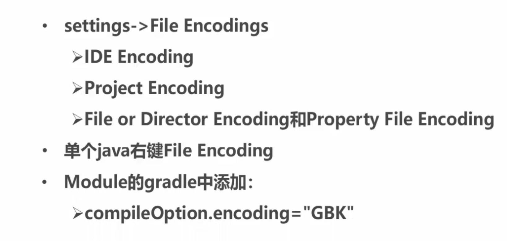

## 项目导入版本兼容问题

**1. 修改相应项目/模块的build.gradle**

```gradle
android {
    compileSdkVersion 30
    buildToolsVersion "30.0.2"

    defaultConfig {
        applicationId "com.iqqcode.helloworld"
        minSdkVersion 16
        targetSdkVersion 30
        versionCode 1
        versionName "1.0"

        testInstrumentationRunner "androidx.test.runner.AndroidJUnitRunner"
    }
}

dependencies {
	compile ''
}
```

**2. gradle-wrapper.properties**

修改项目`\gradle\wrapper\`

```gradle
distributionUrl=https\://services.gradle.org/distributions/gradle-6.5-all.zip
```

<br>

## 中文乱码问题



修改响应项目下的`build.gradle`编码

```java
android {
    compileSdkVersion 30
    buildToolsVersion "30.0.2"

    defaultConfig {
        applicationId "com.iqqcode.helloworld"
        minSdkVersion 16
        targetSdkVersion 30
        versionCode 1
        versionName "1.0"
    }
    buildTypes {
        
    }
    compileOptions {
        encoding "GBK"
    }
}

dependencies {
	compile ''
}
```


