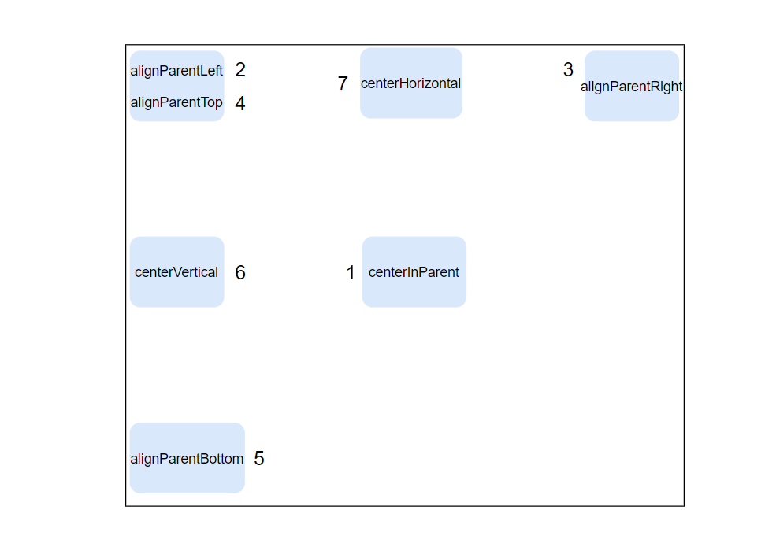
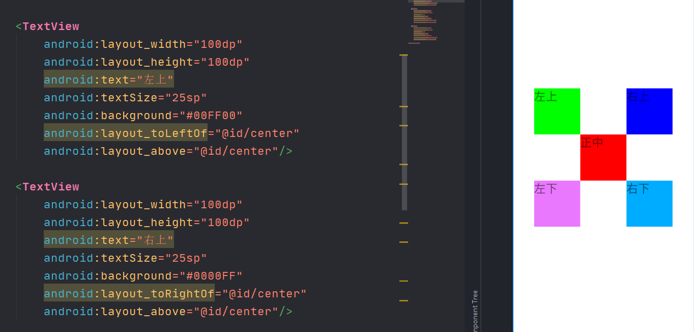
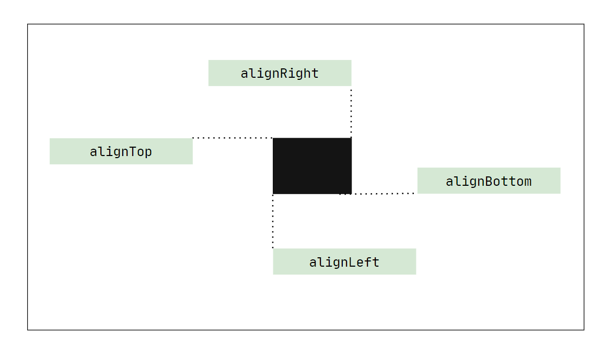
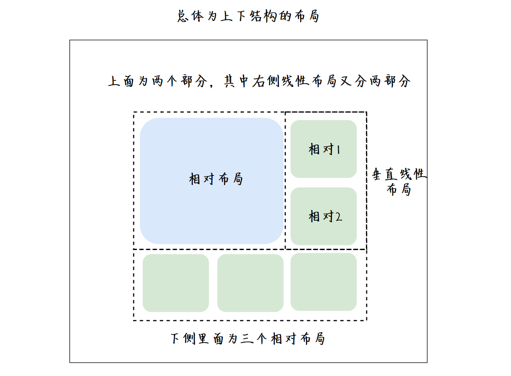
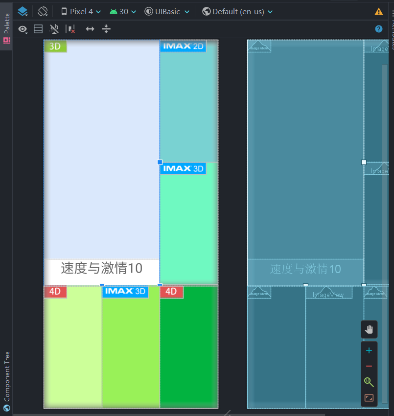

## 相对布局的重要属性

- [x] 关键是选取参照物，是父容器还是其他控件
- [x] 布局位置与代码的前后顺序无关，只与属性设置有关

**相对于父容器（取值：true/false）**

```xml
android:layout_alignParentRight
```

**相对于其他控件（取值：其他控件id）**

```xml
android:layout_toRightOf
```

<br>

### 参照父容器

【参照格式】

```xml
android:layout_centerInParent="true"
```

属性值

```xml
1 - android:layout_centerInParent    正中位置
2 - android:layout_alignParentLeft   左上
3 - android:layout_alignParentRight  右上
4 - android:layout_alignParentTop    顶部(偏左)
5 - android:layout_alignParentBottom 底部(偏左)
6 - android:layout_centerVertical    中部(偏左)
7 - android:layout_centerHorizontal  顶部中间
```



### 参照其他控件

参照某一`id`控件的相对位置

```xml
android:layout_above="@id/center"
```

**I. 【在参照物的某边】**

- `android:layout_above`: 上边
- `android:layout_below`: 下边
- `android:layout_toLeftOf`: 左边
- `android:layout_toRightOf`: 右边



**II. 和参照物的某边线对齐**

- `android:layout_alignTop`: 上边线
- `android:layout_alignBottom`: 下边线
- `android:layout_alignLeft`: 左边线
- `android:layout_alignRight`: 右边线

```xml
<TextView
    android:layout_width="200dp"
    android:layout_height="40dp"
    android:background="#6ff9c1"
    android:layout_alignRight="@id/center"/>
```



## 页面Demo



如何确定宽高的属性值？

- **拆谁就将谁设置为`0dp`**

【第一步】：先分为上下两部分**水平布局**，由于是上下分，所以宽不变

- `android:layout_width="match_parent"`
- `android:layout_height="0dp"`

【第二步】：下部分分为三个相对布局，高不变，拆分宽

- `android:layout_width="0dp"`
- `android:layout_height="match_parent"`

【第三部】：上面分为左右两大部分，左侧为相对布局，右侧为一个大整体，大整体下分两个相对布局

[3.1] 两大部分-高不变，拆分宽

- `android:layout_width="0dp"`
- `android:layout_height="match_parent"`

[3.2] 右侧两个相对**垂直布局**，宽不变，拆分高

- `android:layout_width="match_parent"`
- `android:layout_height="0dp"`



<kbd>View_LinearLayout.xml</kbd>

```xml
<?xml version="1.0" encoding="utf-8"?>
<LinearLayout xmlns:android="http://schemas.android.com/apk/res/android"
    android:orientation="vertical" android:layout_width="match_parent"
    android:layout_height="match_parent">

    <!--上半部分-->

    <LinearLayout
        android:layout_width="match_parent"
        android:layout_height="0dp"
        android:orientation="horizontal"
        android:layout_weight="2">
        <RelativeLayout
            android:layout_width="0dp"
            android:layout_height="match_parent"
            android:background="#DAE8FC"
            android:layout_weight="2">
            <ImageView
                android:layout_width="wrap_content"
                android:layout_height="wrap_content"
                android:src="@mipmap/icon_3d"/>
            <TextView
                android:layout_width="match_parent"
                android:layout_height="60dp"
                android:text="速度与激情10"
                android:textSize="30sp"
                android:textAlignment="center"
                android:textColor="#666666"
                android:background="#FFFFFF"
                android:layout_alignParentBottom="true"/>
        </RelativeLayout>
        <LinearLayout
            android:layout_width="0dp"
            android:layout_height="match_parent"
            android:layout_weight="1"
            android:orientation="vertical">
            <RelativeLayout
                android:layout_width="match_parent"
                android:layout_height="0dp"
                android:background="#79d2d2"
                android:layout_weight="1">
                <ImageView
                    android:layout_width="wrap_content"
                    android:layout_height="wrap_content"
                    android:src="@mipmap/icon_imax2d"/>
            </RelativeLayout>
            <RelativeLayout
                android:layout_width="match_parent"
                android:layout_height="0dp"
                android:layout_weight="1"
                android:background="#6ff9c1">
                <ImageView
                    android:layout_width="wrap_content"
                    android:layout_height="wrap_content"
                    android:src="@mipmap/icon_imax3d"/>
            </RelativeLayout>
        </LinearLayout>
    </LinearLayout>

    <!--下半部分-->

    <LinearLayout
        android:layout_width="match_parent"
        android:layout_height="0dp"
        android:orientation="horizontal"
        android:background="#D5E8D4"
        android:layout_weight="1">
        <RelativeLayout
            android:layout_width="0dp"
            android:layout_height="match_parent"
            android:background="#ccff99"
            android:layout_weight="1">
            <ImageView
                android:layout_width="wrap_content"
                android:layout_height="wrap_content"
                android:src="@mipmap/icon_4d"/>
        </RelativeLayout>
        <RelativeLayout
            android:layout_width="0dp"
            android:layout_height="match_parent"
            android:background="#99f158"
            android:layout_weight="1">
            <ImageView
                android:layout_width="wrap_content"
                android:layout_height="wrap_content"
                android:src="@mipmap/icon_imax3d"/>
        </RelativeLayout>
        <RelativeLayout
            android:layout_width="0dp"
            android:layout_height="match_parent"
            android:background="#02b340"
            android:layout_weight="1">
            <ImageView
                android:layout_width="wrap_content"
                android:layout_height="wrap_content"
                android:src="@mipmap/icon_4d"/>
        </RelativeLayout>
    </LinearLayout>

</LinearLayout>
```

