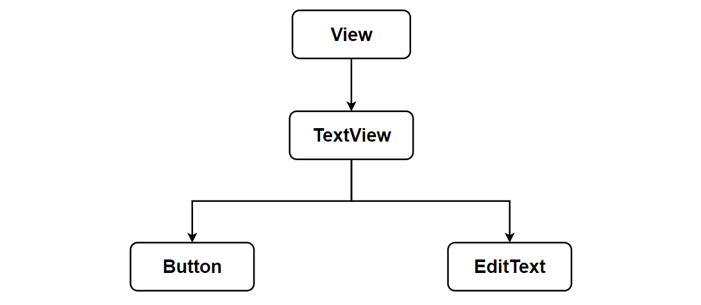

## 1.View

控件(view) : 所有UI组件的父类，屏幕上所有可视的控件都叫做**View**，所有的控件都继承自View

常用的界面控件:

- 处理文本内容的View(TextView)
- 被点击的View(Button)
- 处理图片内容的View(ImageView)
- 接收用户信息输入的View(EditText)
- 进度条类的View(ProgressBar)

**控件通用属性**

| 属性                                          | 常用可选值                                                   |
| --------------------------------------------- | ------------------------------------------------------------ |
| android:layout_width<br>android:layout_height | 正整数单位dp &nbsp;精确大小<br>match_parent &nbsp;填充整个父容器<br>wrap_content &nbsp;根据所含内容确定大小 |
| android:id                                    | @id/valName &nbsp; 使用已存在id<br>@+id/valName &nbsp; 添加新id |
| android:layout_margin                         | 正整数单位dp &nbsp;与相邻控件或边缘的距离                    |
| android:padding                               | 正整数单位dp &nbsp;控件内容相距控件边缘的距离                |
| android:background                            | 十六进制的颜色值 &nbsp;图片作为背景<br>@mipmap/resourceId &nbsp;图片作为背景 |
| android:layout_gravity<br/>android:gravity    | center_horizontal &nbsp;水平居中<br>center_vertical &nbsp;垂直居中<br>center &nbsp;水平垂直居中<br>left &nbsp;居左<br/>right &nbsp;居右<br/>top &nbsp;居顶<br/>bottom &nbsp;居底 |
| android:visibility                            | visible &nbsp;可见状态<br/>invisible &nbsp;不可见状态，但保留控件位置<br/>gone &nbsp;不可见状态，不保留控件位置 |

- android:layout_gravity：自己相对于父容器的偏向(偏向于上下左右)
- android:gravity：控件中的内容相对于控件本身的偏向


## 2.TextView

**TextView** : Android中用来处理文本的控件，继承自**View**



【TextView功能】

- 对长文文本进行显示处理
- 支持HTML代码
- 内容有样式、链接效果

## 【控件事件的四种使用方式】

**e.g: Button注册点击事件**

**1. 自定义内部类**

- 多个按钮执行相似的事件，直接在外部绑定对象即可

**2. 匿名内部类**

- 可以直观的看到该按钮对应的事件(适用于唯一操作的按钮)

**3. 当前Activity去实现事件接口**

- 当前的Acyivity类实现`View.OnClickListener`

**4. 在XML布局文件中添加点击事件属性**

- 通过switch语句，适用于控制多个按钮的点击事件

创建ButtonActivity

```java
public class ButtonActivity extends AppCompatActivity implements View.OnClickListener {
    @Override
    protected void onCreate(Bundle savedInstanceState) {
        super.onCreate(savedInstanceState);
        setContentView(R.layout.activity_button);

        //1.自定义内部类
        Button button1 = findViewById(R.id.btn1);
        //点击事件: 被点击时触发的事件
        MyClickListener myClickListener = new MyClickListener();
        // 为按钮注册点击事件监听器(自定义内部类)
        button1.setOnClickListener(myClickListener);

        //2.匿名内部类
        Button button2 = findViewById(R.id.btn2);
        button2.setOnClickListener(new View.OnClickListener() {
            @Override
            public void onClick(View v) {
                Log.e("TAG", "匿名内部类");
            }
        });

        //3.当前Activity实现OnClickListener事件接口
        Button button3 = findViewById(R.id.btn3);
        button3.setOnClickListener(this);
    }

    @Override
    public void onClick(View v) {
        Log.e("TAG", "当前Activity实现OnClickListener事件接口");
    }

    // 自定义内部类
    class MyClickListener implements View.OnClickListener {

        @Override
        public void onClick(View v) {
            Log.e("TAG", "刚刚点击的按钮注册了内部类监听器");
        }
    }


    //被点击的控件对象
    public void myClick(View v) {
        switch(v.getId()) {
            case R.id.btn4:
                Log.e("TAG", "btn4通过XML绑定的点击事件...");
                break;
            case R.id.btn5:
                Log.e("TAG", ">>>>>btn5-------");
                break;
            default:
                break;
        }
    }
}
```

activity_button.xml

```xml
<?xml version="1.0" encoding="utf-8"?>
<LinearLayout xmlns:android="http://schemas.android.com/apk/res/android"
    xmlns:app="http://schemas.android.com/apk/res-auto"
    xmlns:tools="http://schemas.android.com/tools"
    android:layout_width="match_parent"
    android:layout_height="match_parent"
    tools:context=".ButtonActivity"
    android:orientation="vertical">

    <Button
        android:id="@+id/btn1"
        android:layout_width="match_parent"
        android:layout_height="wrap_content"
        android:text="自定义内部类">
    </Button>

    <Button
        android:id="@+id/btn2"
        android:layout_width="match_parent"
        android:layout_height="wrap_content"
        android:text="匿名内部类">
    </Button>

    <Button
        android:id="@+id/btn3"
        android:layout_width="match_parent"
        android:layout_height="wrap_content"
        android:text="通过当前Activity去实现点击事件接口">
    </Button>

    <Button
        android:id="@+id/btn4"
        android:layout_width="match_parent"
        android:layout_height="wrap_content"
        android:text="在xml布局文件中绑定点击事件"
        android:onClick="myClick">
    </Button>

    <Button
        android:id="@+id/btn5"
        android:layout_width="match_parent"
        android:layout_height="wrap_content"
        android:text="=====Button5====="
        android:onClick="myClick">
    </Button>
</LinearLayout>
```

<br>

## 3.ImageView

用来显示和控制图像的控件，可对其进行放大、缩小、旋转等操作

【常用属性】

- android:src
- android:background

## 4.ProgressBar

**进度条**，默认情况下是圆形，没有刻度，只是一个不断旋转的动画效果。通过设置style,可以显示传统的水平带刻度进度条

进度条：默认样式是转圈。修改样式需设置风格

- style 设置风格progressBarStyleHorizontal（水平进度条）
- android:progress="60" 设置进度
- android:max="100" 设置最大值，默认100
- android:indeterminate="true"  设置进度条一直滚动