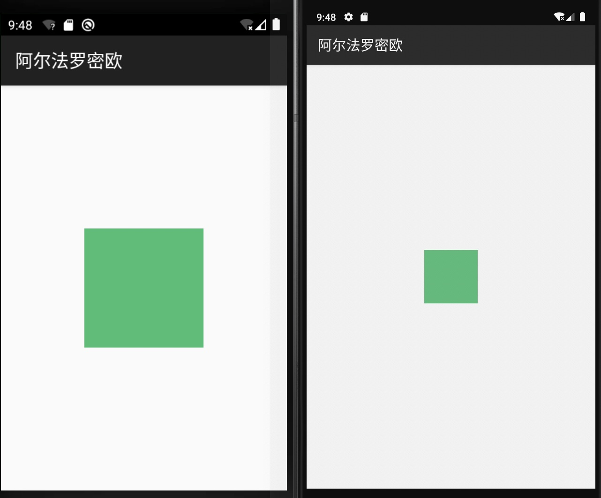
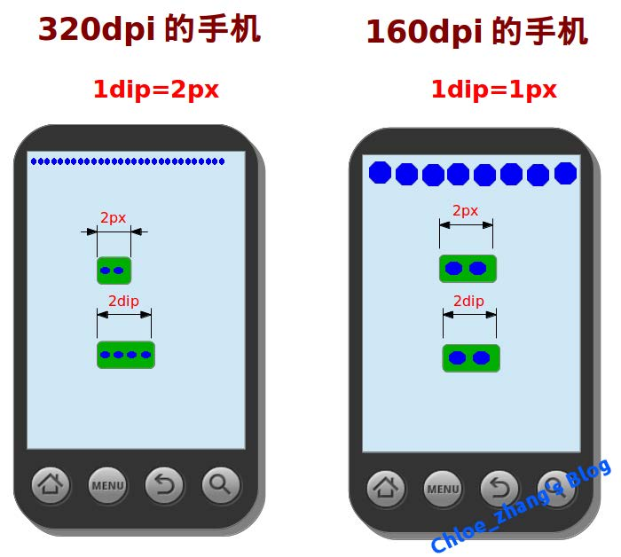
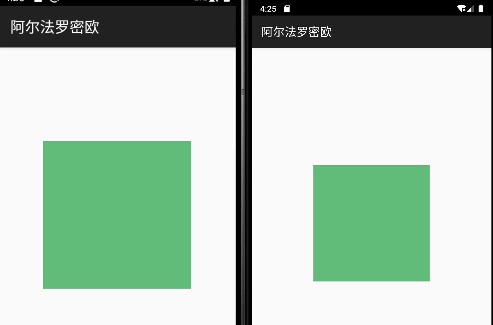
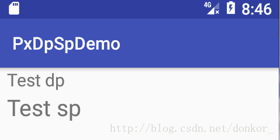
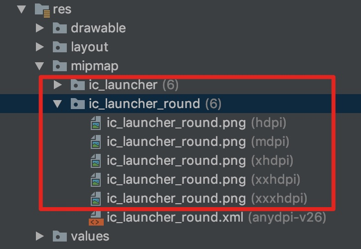
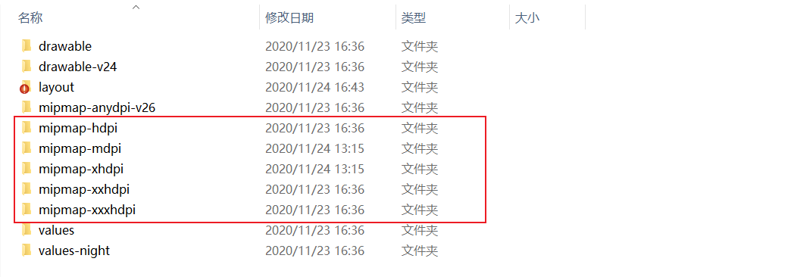

## 1.基础属性长度单位概况

**dpi**：全称是dots per inch，每英寸长度所的像素点个数,也就是屏幕密度。

> 如常说的手机分辨率：1080 x 1920 指的是手机宽度可展示1080像素，高度可展示1920像素。

**ppi** : Pixels Per Inch 每英寸长度所具有的像素个数，单位面积内像素越多，图像显示越清晰。

> ppi一般用在显示器、手机、平板等描述屏幕精细度。

**density**：`density = dpi/160`

**dp**：dp也叫dip，是device independent pixels。设备不依赖像素的一个单位。在不同的像素密度的设备上会自动适配，比如:

- 在320x480分辨率，像素密度为160,1dp=1px
- 在480x800分辨率，像素密度为240,1dp=1.5px

**sp**：字体的单位，和dp差不多，区别是如果字体使用的sp为单位，那如果你手机字体调大了，那你app的字体会随之变大，如果用dp则不会变化。

**px**：pixel，即像素，1px代表屏幕上的一个物理的像素点。但px单位不被建议使用。因为**同样像素大小的图片在不同手机显示的实际大小可能不同**。要用到px的情况是需要画1像素表格线或阴影线的时候，如果用其他单位画则会显得模糊。

### 单位转换

**计算dpi、density**

以5.5寸1920 * 1080的手机为例：

5.5寸是指手机对角线的长度，分辨率是1920 * 1080，也就是知道长像素是1920，宽像素是1080，那么对角线多长呢，其实就是求斜边的长度: `1920^2+1080^2=2202^2`

$dpi = \frac{\sqrt{height^{2} +width^{2} } }{size}  $

所以 **dpi=2202/5.5=400**

height和width即为长宽的像素，平方和即为对角线的像素个数，size即我们常说的5寸手机、4寸手机中的5和4，即对角线的长度

<br>

**dp和px转换**

要理解dp，首先要先引入dpi这个概念，，所以，它的计算公式如下：

`px = dp * (dpi/160)`

<br>

### dp与px工具类转换

```java
public class DensityUtil {

    /**
     * 根据手机的分辨率从 dp 的单位 转成为 px(像素)
     */
    public static int dp2px(Context context, float dpValue) {
        final float scale = context.getResources().getDisplayMetrics().density;
        return (int) (dpValue * scale + 0.5f);
    }

    /**
     * 根据手机的分辨率从 px(像素) 的单位 转成为 dp
     */
    public static int px2dp(Context context, float pxValue) {
        final float scale = context.getResources().getDisplayMetrics().density;
        return (int) (pxValue / scale + 0.5f);
    }
}
```

## 2.dp/dpi

### px-受设备影响

布局如下：

```xml
<?xml version="1.0" encoding="utf-8"?>
<FrameLayout xmlns:android="http://schemas.android.com/apk/res/android"
    xmlns:tools="http://schemas.android.com/tools"
    android:id="@+id/big"
    android:layout_width="match_parent"
    android:layout_height="match_parent"
    tools:context=".MainActivity">


    <View
        android:layout_gravity="center"
        android:background="@color/green"
        android:layout_width="200px"
        android:layout_height="200px">
    </View>

</FrameLayout>
```

View长宽都是200px，分别在分辨率为480(宽)x800(高）简称A设备、1080(宽)x1920(高）简称B设备，效果如下:



左边是A设备，右边是B设备。问题出来了，同样长宽都是200px，为啥A设备显示很大，B设备显示很小呢？你可能会说B设备的横向分辨率1080比A设备的480大，所以在B设备上看起来比较小。

来看看A、B设备横向到底是多少英寸，怎么来计算呢？这时候就需要用到`ppi`了，既然知道横向的像素点个数，也知道每英寸能容纳的像素点，当然可以得知横向的尺寸了。

```java
DisplayMetrics.java
    /**
     * The exact physical pixels per inch of the screen in the X dimension.
     */
    public float xdpi;
    /**
     * The exact physical pixels per inch of the screen in the Y dimension.
     */
    public float ydpi;
```

其中一种方式获取DisplayMetrics对象：

> DisplayMetrics displayMetrics = getResources().getDisplayMetrics();

- A设备宽度尺寸：480(px)/240(ppi)=2inch

- B设备宽度尺寸：1080(px)/420(ppi)=2.5inch

可以看出，A、B设备尺寸差别不大。A设备ppi=240，B设备ppi=420。明显地看出B设备单位长度上比A设备能够容纳更多的像素，因此同样的200px，B设备只需要较小的尺寸就能够显示，因此在B设备上的view看起来比A设备小很多。

> 我们想要的效果是：同一大小的view在不同的设备上“看起来一样大”

我们总不能自己判断每个设备的ppi，然后计算实际需要多少像素，再动态设置view的大小吧，那layout里的静态布局大小就无法动态更改适应了。想当然的能有一个统一的地方替我们转换，没错！Android系统已经帮我们实现了转换。接下来就是dpi、dp出场了。

### 引入dp/dpi

**Android系统使用`dpi`来描述屏幕的密度，使用`dp`来描述密度与像素的关系。**

- A设备dpi=240

- B设备dpi=420

Android系统最终识别的单位是px，怎么将dpi和px关联起来呢？，答案是dp。

Android规定当

- `dpi=160`时，1dp=1px;

- `dpi=240`时，1dp=1.5px

依此类推，并且给各个范围的dpi取了简易的名字加以直观的识别，如120<dpi<=160，称作为mdpi，120<dpi<=240 称作hdpi，最终形成如下规则：

```xml
ldpi（value <= 120 dpi)
mdpi（120 dpi < value <= 160 dpi）
hdpi（160 dpi < value <= 240 dpi）
xhdpi（240 dpi < value <= 320 dpi）
xxhdpi（320 dpi < value <= 480 dpi）
xxxhdpi（480 dpi < value <= 640 dpi）
```

**dp能够在不同dpi设备上对应不同px，相当于中间转换层**。

| 密度类型           | 代表的分辨率(px) | 屏幕密度(dpi) | 换算(px/dp) | 比例 |
| ------------------ | :--------------- | ------------- | ----------- | :--: |
| 低密度(ldpi)       | 240x320          | 120           | 1dp=0.75px  |  3   |
| 中密度(mdpi)       | 320x480          | 160           | 1dp=1px     |  4   |
| 高密度(hdpi)       | 480x800          | 240           | 1dp=1.5px   |  6   |
| 高密度(hdpi)       | 720x1280         | 320           | 1dp=2px     |  8   |
| 超超高密度(xxhdpi) | 1080x1920        | 480           | 1dp=3px     |  12  |




我们只需要将view长宽单位设置为合适的dp，就无需关注设备之间密度差异，系统会帮我们完成`dp-px`转换。将我们之前的例子稍微更改，再看看效果验证一下：

```xml
<?xml version="1.0" encoding="utf-8"?>
<FrameLayout xmlns:android="http://schemas.android.com/apk/res/android"
    xmlns:tools="http://schemas.android.com/tools"
    android:id="@+id/big"
    android:layout_width="match_parent"
    android:layout_height="match_parent"
    tools:context=".MainActivity">


    <View
        android:layout_gravity="center"
        android:background="@color/green"
        android:layout_width="200dp"
        android:layout_height="200dp">
    </View>

</FrameLayout>
```



综上所述，dp作为中间单位为我们屏蔽了不同密度设备差异，这也是为啥dp/dip叫做“设备（密度）无关像素”的原因。

## 3.举例分析

### dp与px

我们做个简单的Sample验证一下，如下,一个布局代码

```xml
    <Button
        android:layout_width="150px"
        android:layout_height="wrap_content"
        android:text="Test px" />
    <Button
        android:layout_width="150dp"
        android:layout_height="wrap_content"
        android:text="Test dp" />
```

在480*800分辨率中，3.7屏幕对角线英寸数的设备效果图如下


在480*800分辨率中，5.1屏幕对角线英寸数的设备效果图如下


▲ 由此可以看出使用px作为单位的，在不同的设备中会显示不同的效果

**使用dp作为单位的，会根据不同的设备进行转化，适配不同机型。所以建议在长度宽度的数值使用dp作为单位。**

<br>

### dp与sp

dp可以自动适配设备机型，那在字体里是否也同样可行？我们再做个简单的Sample验证一下，如下,一个布局代码

```xml
    <TextView
        android:layout_width="wrap_content"
        android:layout_height="wrap_content"
        android:text="Test dp"
        android:textSize="20dp" />
    <TextView
        android:layout_width="wrap_content"
        android:layout_height="wrap_content"
        android:text="Test sp"
        android:textSize="20sp" />
```

在480*800分辨率中，3.7屏幕对角线英寸数的设备效果图如下


在480*800分辨率中，3.7屏幕对角线英寸数的设备下，我们修改手机系统字体大小，得到效果图如下



▲ **由此可以看出使用sp作为字体大小单位,会随着系统的字体大小改变，而dp作为单位则不会。**

**所以建议在字体大小的数值要使用sp作为单位**

<br>

## 4.mipmap图片资源文件

通过上面对dp的了解，我们知道在设定view大小、间距时使用dp能最大限度地屏蔽设备密度之间的差异。

那么，在mipmap下存放的图片，也是以`px`为单位的呀，依然会出现上述问题。bitmap展示的时候如何适配不同密度的设备呢？

```java
    @Override
    protected void onMeasure(int widthMeasureSpec, int heightMeasureSpec) {
        setMeasuredDimension(bitmap.getWidth(), bitmap.getHeight());
    }

    private void init() {
        String path = Environment.getExternalStorageDirectory() + "/Download/photo1.jpg";
        bitmap = BitmapFactory.decodeFile(path);
        paint = new Paint();
        paint.setAntiAlias(true);
    }

    @Override
    protected void onDraw(Canvas canvas) {
        super.onDraw(canvas);

        Rect src = new Rect(0, 0, bitmap.getWidth(), bitmap.getHeight());
        RectF rectF = new RectF(0, 0, bitmap.getWidth(), bitmap.getHeight());
        canvas.drawBitmap(bitmap, src, rectF, paint);
    }
```

自定义view从磁盘上加载一张图片，并将之显示在view上，view的大小决定于bitmap大小。依旧以上述A、B设备为例，展示结果如下：


左边是A设备，右边是B设备。

明显地看出，在A设备显示比B设备大很多，实际上和我们之前用px来描述view的大小原理是一样的，bitmap的宽、高都是px在描述，而bitmap决定了view的宽、高，最终导致A设备和B设备上的view大小（宽、高像素）是一样的，而它们屏幕密度又不相同，因此产生了差异。

那不会每次都需要我们自己根据屏幕密度来转换bitmap大小吧？幸运的是，Android已经为我们考虑到了。



如上图，在Android Studio创建工程的时候，默认在res下创建mipmap目录，这些mipmap目录按照密度分为mdpi/hdpi/xhdpi/xxhdpi/xxxhdpi，看起来都在“一个“mipmap”目录下，实际上分为不同的目录：



生成不同密度的目录有什么作用？

- A设备dpi=240，根据dpi范围，属于hdpi
- B设备dpi=420，根据dpi范围，属于xxhdpi

图片原始尺寸：photo1.jpg(宽高 172px-172px)

当我们想要在不同密度设备上显示同一张图片并且想要“看起来一样大时”。假设设计的时候以hdpi为准，放置photo1.jpg为172*172，那么根据计算规则在xxhdpi上需要设置photo1.jpg为:

```xml
scale = 480 / 240 = 2
width = 172 * 2 = 344
height = 172 * 2= 344
```

> [注]：这里为什么要放大？可以这么理解，因为B设备密度大，通常来说密度越大单位尺寸内需要的像素越多，假设A设备上172*172占据1inch面积，那么为了能够在B设备上填充满相同的面积需要更多的像素，因此B设备上的图片分辨率应该更大（这里说的通常是因为真正决定设备单位尺寸内容纳的像素个数的因素是ppi，有些设备dpi比较大，但是ppi反而小）

现在hdpi和xxhdpi目录下分别存放了同名图片：photo1.jpg，只是大小不同。当程序运行的时候：

> A设备发现自己密度属于hdpi，它会直接到hdpi下寻找对应的photo1.jpg并显示
>
> B设备发现自己密度属于xxhdpi，它会直接到xxhdpi下寻找对应的photo1.jpg并显示

看看效果：


左边A设备，右边B设备
 针对不同的密度设计不同的图片大小，最大限度保证了同一图片在不同密度设备上表现“看起来差不多大”。
 来看看A、B设备上图片占内存大小：

> A设备 172 * 172 * 4 = 118336 ≈ 116k
>
> B设备 344 * 344 * 4 = 473344 ≈ 462k
>
> 注：解析bitmap时，默认inPreferredConfig=ARGB_8888，也就是每个像素有4个字节来存储

说明在B设备上显示photo1.jpg需要更多的内存。

上边只是列举了hdpi、xxhdipi，同理对于mdpi、xhdpi、xxxhdpi根据规则放入相应大小的图片，程序会根据不同的设备密度从对应的mipmap文件夹下加载资源。如此一来，我们无需关注bitmap在不同密度设备上显示问题了。

-------------------------

这篇转载的文章，着重是来介绍Android属性长度单位的，如果更深入的涉及到**屏幕的分辨率适配**，还需进一步探究。

-----------------

【参考文章】

[1] Donkor-. 两分钟理解Android中PX、DP、SP的区别.http://blog.csdn.net/donkor_/article/details/77680042

[2] fishforest.Android 屏幕分辨率适配.https://www.jianshu.com/p/72e6e1e83b96

